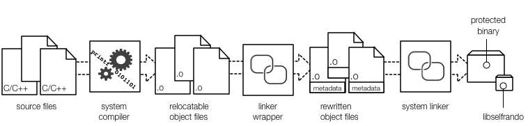

# Selfrando Design

Selfrando aims to fulfill the following goals:

1. Randomize code layout at a finer granularity than ASLR
2. Avoid diversity on disk; randomize in-memory representation
3. Avoid changes to existing compilers and linkers
4. Avoid changes to the host operating systems

# Known Issues

- 64-bit operation has been tested more extensively than 32-bit operation.
- See our issue tracker for specific known problems
